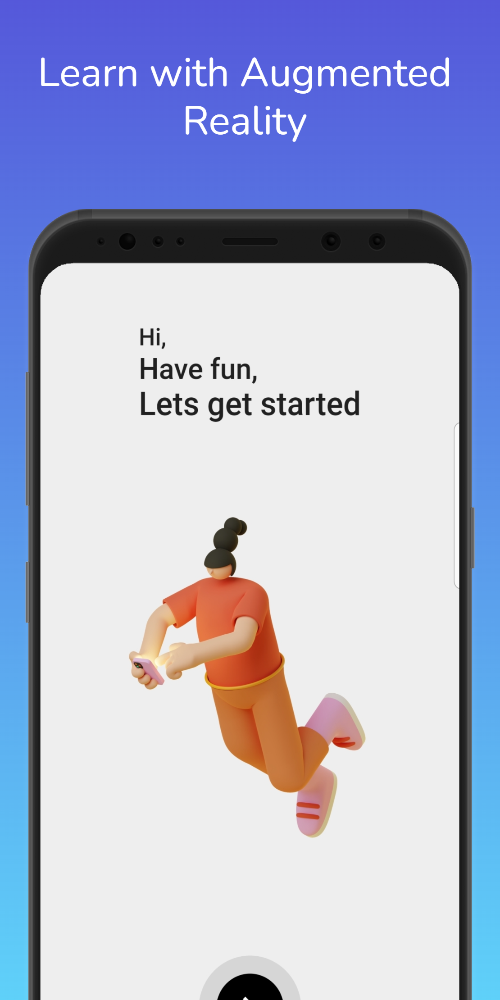
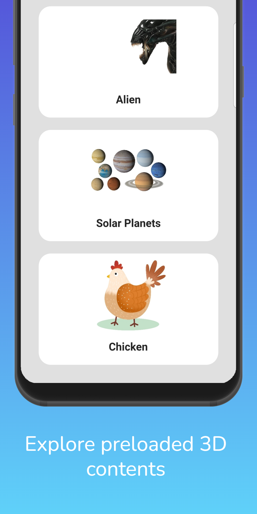
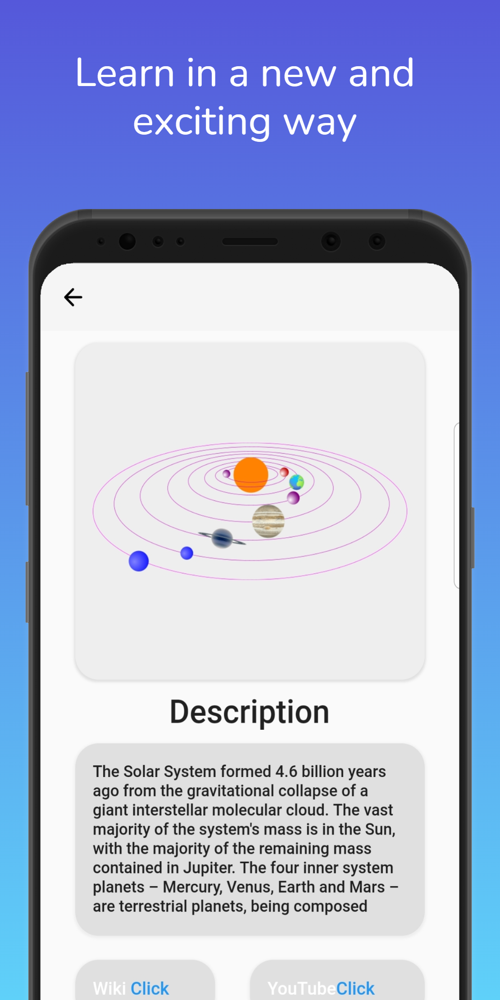
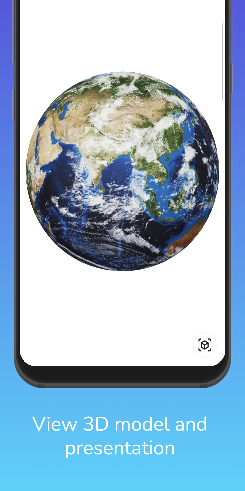
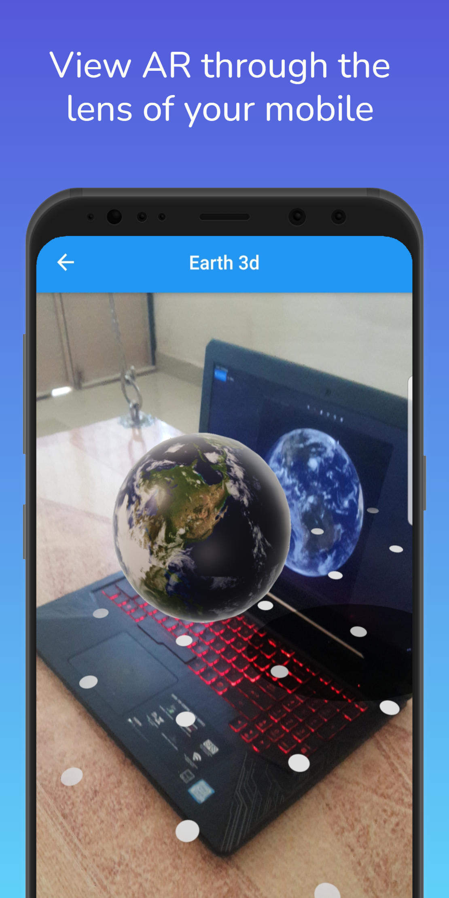
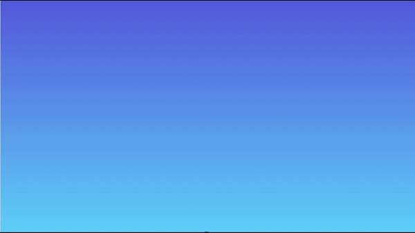

# TeachAR
- The purpose of this project is to offer a platform of Augmented Reality to help students understand a difficult topic.
- A suggested application for teaching and studying astronomy, the human body anatomy, and volcanology were developed in this project. 
- The technology is anticipated to increase their degree of comprehension about learning by providing them with both easy operability and immersive sense.
- Using this method, students may improve their understanding of planets, planet types, moons, size, distance, orbit, rings, rotation, and other topics. 
- Learners who use Augmented Reality (AR) may observe the solar orbit and planets as if they were physically there at the site. 
User should be able to grasp the anatomy of the human body with ease utilizing a 3D picture representation. 

# Screenshots

# Video
 

## Technology Used
<!-- Add the used technology names of project. -->

 
 

 

## Software Requirements
- Language: Dart 
- Framework: Flutter 
- Database: Firebase 
- IDE: Android Studio 
- SDK: Google AR Core 
- Graphic Software: Blender

## Hardware Requirements
 - Operating system: Android 7.0 (API Level 24) 
 - RAM: 4GB 
 - ROM: 265MB 
 - GPU: OpenGL ES Versions: 3.0 or 3.2 
 - Camera: Depth API Support 
 - Sensor: Time-F-Flight (Tof) Hardware Depth Sensor
 - Display: Multiple GPU Texture Resolutions - 1080p, 720p, 480p 

 ## Blender Workflow

- Creating 3D model in blender

- Developing augmented reality object

-  Animation scene of the solar system model 

## 3D Model List

- Dinosaur Model

- Human Anatomy Model

- Planets Model

- Spacecraft Model

- Volcano

